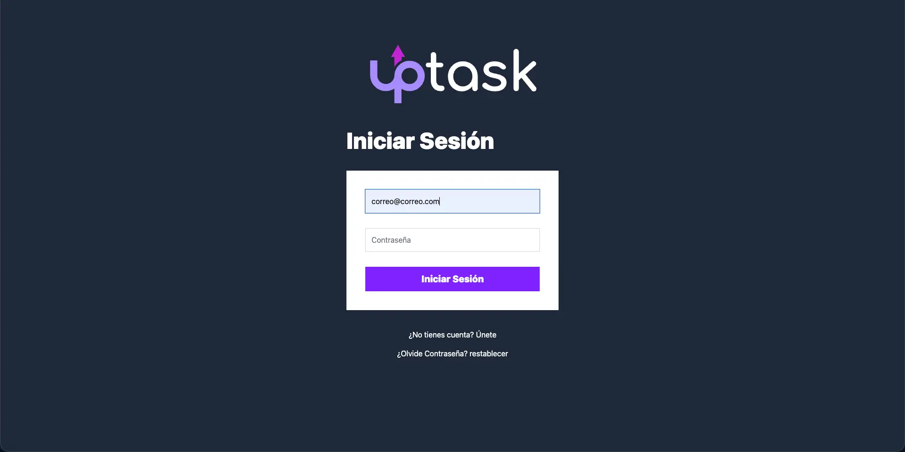
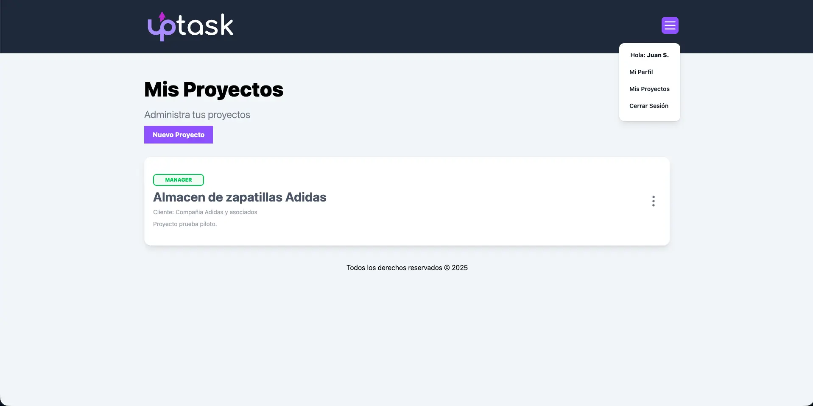
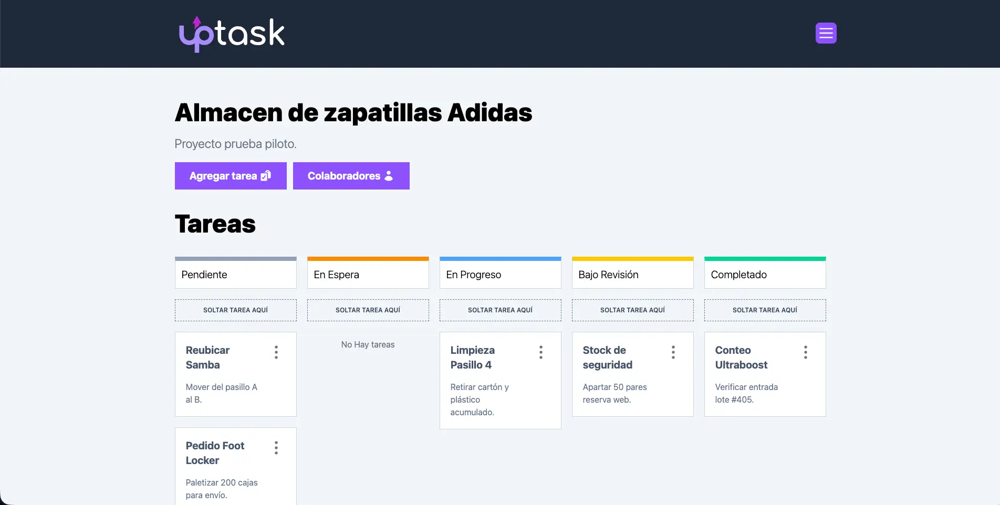
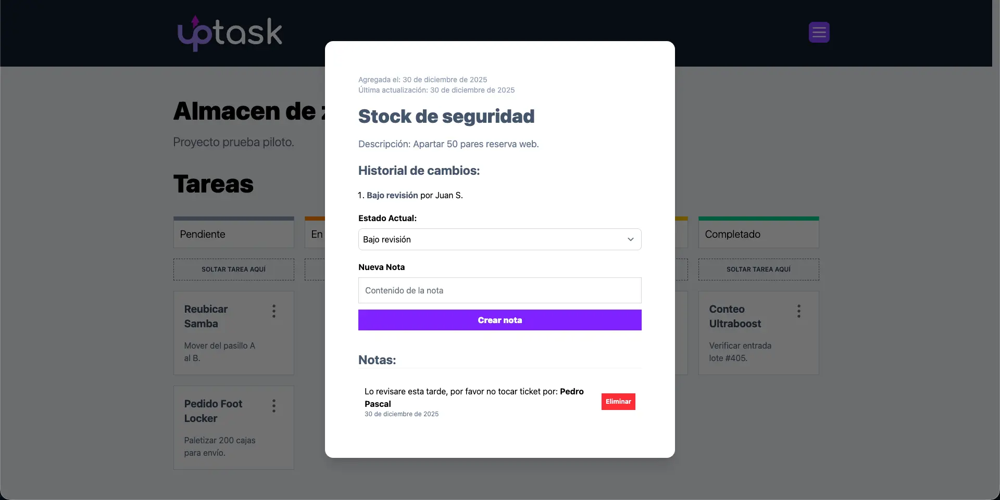

<table width="100%" align="center">
  <tr>
    <td align="center" valign="middle">
      <h1>🗒️ UpTask - Frontend Project Management</h1>
      
<b>Gestión de Proyectos Colaborativa en Tiempo Real</b>

      

      
React | TypeScript | Vite | TailwindCSS | TanStack Query | Zod | Axios

    </td>
  </tr>
</table>

<table>
  <tr>
    <td width="50%">
      

        
      

    </td>
    <td width="50%">
      

        
      

    </td>
  </tr>
  <tr>
    <td width="50%">
      

        
      

    </td>
    <td width="50%">
      

        
      

    </td>
  </tr>
</table>

## Credenciales de Prueba

Para facilitar la revisión del proyecto, puede utilizar las siguientes credenciales de acceso:

**Usuario:** tester@gmail.com

**Contraseña:** tester123

## Visión General

La interfaz de cliente de UpTask es moderna y diseñada para ofrecer una experiencia de usuario fluida e instantánea. Permite a los equipos crear proyectos, asignar tareas y colaborar de forma segura, con una UI optimizada que reacciona en tiempo real a los cambios del estado.

Este frontend consume una API Restful segura y maneja lógica compleja de permisos y roles (Manager vs. Colaborador) directamente en el navegador.

---

## Stack Tecnológico y Justificación Técnica

La elección del stack prioriza el rendimiento (Vite), la seguridad de tipos (TypeScript) y la gestión eficiente del estado asíncrono.

| Tecnología | Implementación y Justificación |
| :--- | :--- |
| **React + Vite** | Utilizamos Vite como bundler para un entorno de desarrollo ultrarrápido y una compilación optimizada para producción. React maneja la interactividad de la UI mediante componentes funcionales. |
| **TypeScript** | Implementación estricta de tipos. Al definir interfaces para `Project`, `Task` y `User` y mejoramos la mantenibilidad del código. |
| **TanStack Query (React Query)** | Decisión Clave: En lugar de useEffects manuales o Redux, usamos React Query para gestionar el estado del servidor. Esto nos da caché automática, reintentos en caso de error y actualizaciones en segundo plano (optimistic updates). |
| **TailwindCSS + Headless UI** | Diseño basado en utilidades para una maquetación rápida y responsiva. Headless UI proporciona componentes accesibles (Modales, Menús) sin estilos predefinidos, dándonos control total sobre el diseño visual. |
| **React Hook Form** | Gestión de formularios complejos (Login, Creación de Tareas). Su arquitectura "uncontrolled" reduce los re-renderizados innecesarios, mejorando drásticamente el rendimiento en formularios grandes. |

---

## Desafíos de Frontend Resueltos

### 1. Optimistic UI Updates
Para que la aplicación se sienta "nativa", implementamos actualizaciones optimistas. Cuando un usuario cambia el estado de una tarea a "Completada", la UI se actualiza instantáneamente antes de recibir la confirmación del servidor, revirtiendo el cambio solo si la petición falla.

### 2. Gestión de Roles y Permisos
El frontend no solo oculta botones, implementa una lógica robusta para determinar si el usuario logueado es el `Manager` del proyecto o un `Colaborador`. Esto condiciona dinámicamente qué componentes se renderizan (ej: solo el Manager puede eliminar tareas).

### 3. Autenticación Persistente
Sistema de manejo de JWT (JSON Web Tokens) almacenados de forma segura, con interceptores de Axios configurados para inyectar el token en cada petición y redirigir al login automáticamente si la sesión expira.